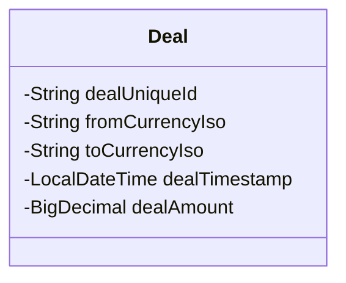

# Clustered Data Warehouse Service

A high-performance, containerized ETL ingestion service designed to validate and persist FX deals. Built with a focus on **idempotency**, **fault tolerance**, and **traceability**.

## Key Features

* **Idempotent Ingestion:** Implements a robust "Duplicate Check" layer. Re-submitting the same deal ID is safe and returns a consistent response without database corruption.
* **Partial Batch Success (No Rollback):** Adheres to the "No Rollback" requirement. Valid deals in a batch are persisted immediately, while invalid deals are isolated and reported in the response. A single failure does not block the entire batch.
* **Database Version Control:** Uses **Liquibase** to manage schema changes, ensuring the database structure is reproducible across environments (Dev/Test/Prod).
* **Fully Containerized:** One-command deployment using Docker & Docker Compose.
* **Strict Validation:** Global Exception Handling catches invalid ISO codes, missing fields, and negative amounts, returning structured `400 Bad Request` responses.

## Tech Stack

* **Language:** Java 17
* **Framework:** Spring Boot 3
* **Database:** PostgreSQL 15
* **Migration:** Liquibase
* **Testing:** JUnit 5, Mockito, H2 (Postgres Mode)
* **Build:** Maven

---


## Data Model


    

## How to Run

### Option 1: Using Makefile (Recommended)
This project includes a Makefile to streamline operations.

```bash

# run ' make help' to see available commands 
make help

# 1. Run Tests (Unit & Integration)
make test

# 2. Start Application (Docker)
make up

# 3. View Logs
make logs

# 4. Stop Application
make down
